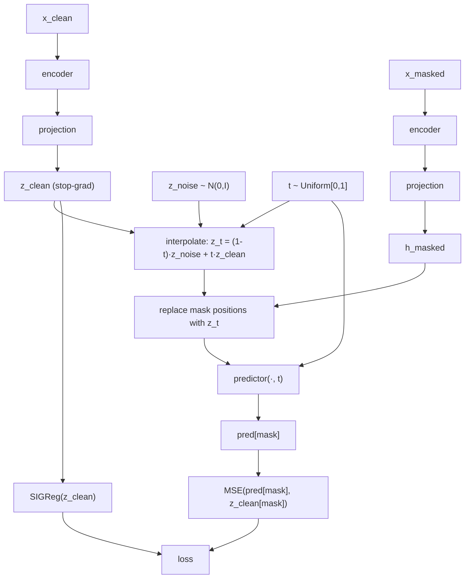
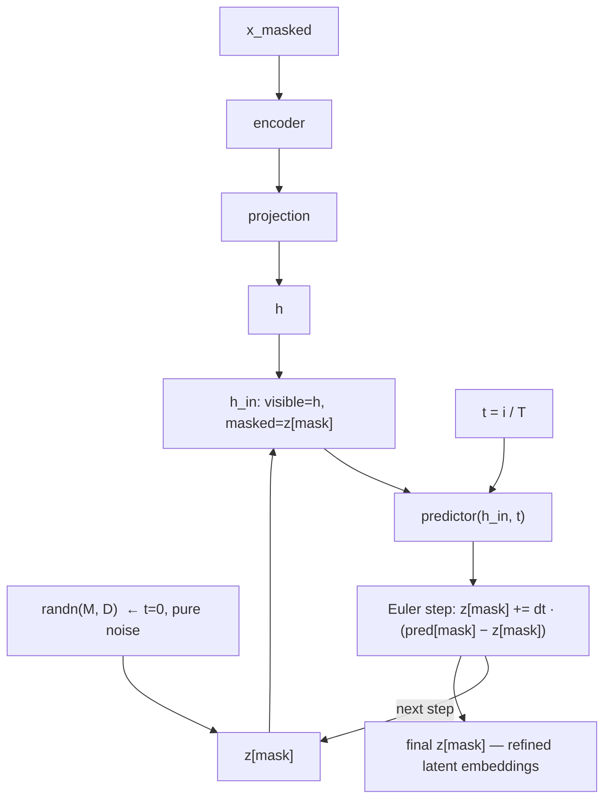

# LeJEPA-Diffusion: Latent Flow Matching on Masked Spans

## Idea

Combine JEPA-style masked prediction with flow matching so the predictor can run multiple denoising steps at inference — without decoding to tokens between steps.

The key argument is not generation quality, but **representation quality or sample efficiency**: a predictor that learns to refine estimates across noise levels builds richer latent structure than a single-step MSE predictor.

---

## Why Naive Iteration Fails

The simpler version — train single-step, repeat predictor at inference — breaks because:

1. **Distribution mismatch**: predictor is trained on `encoder(x_masked)` outputs (where masked positions are `[MASK]` token embeddings). At step 2 it receives its own previous prediction — a completely different distribution.
2. **Mean embedding is unnatural**: MSE training gives `E[target | context]`, a blurry average that doesn't correspond to any real encoder output.
3. **No contraction guarantee**: nothing ensures repeated application of `f` converges rather than diverges.

Flow matching fixes all three: every intermediate state `z_t` is a valid training input, so iteration is always in-distribution.

---

## Architecture

### Overview

**Training**



**Inference**



### Components

| Module | Role | Notes |
|--------|------|-------|
| `TokenEncoder` | Bidirectional transformer, maps tokens → embeddings | Same encoder for clean and masked paths |
| `ProjectionMLP` | Maps anisotropic encoder output → isotropic space | SIGReg lives here |
| `DiffusionPredictor` | Predicts z_clean from noisy z_t, conditioned on t | AdaLN for timestep conditioning |

---

## Forward Process

Linear interpolation (flow matching) between noise and target in projection space:

```
z_t = (1 - t) · z_noise + t · z_clean,    t ~ Uniform[0, 1]
```

- `t = 0`: pure noise — predictor must predict from scratch
- `t = 1`: clean — trivial (predictor sees the answer)
- `t ~ U[0,1]`: predictor learns to refine at every noise level

`z_noise ~ N(0, I)` — matches the isotropic Gaussian target that SIGReg enforces on `z_clean`.

---

## Training Step

```python
def training_step(x_clean, x_masked, mask, model, cfg):
    B, L = x_clean.shape

    # 1. Clean targets (stop-grad on both encoder and projection)
    with torch.no_grad():
        z_clean = model.proj(model.encoder(x_clean))   # (B, L, D)

    # 2. Sample noise level per example
    t = torch.rand(B, device=x_clean.device)            # (B,)

    # 3. Sample noise in projected space
    z_noise = torch.randn_like(z_clean)                 # (B, L, D)

    # 4. Interpolate at masked positions only
    t_exp = t[:, None, None]                            # (B, 1, 1) for broadcast
    z_t = z_clean.clone()
    z_t[mask] = (1 - t_exp) * z_noise[mask] + t_exp * z_clean[mask]

    # 5. Build predictor input:
    #    - visible positions: use projected encoder output of x_masked
    #    - masked positions: use noisy interpolation z_t
    h = model.proj(model.encoder(x_masked))             # (B, L, D)
    h = h.clone()
    h[mask] = z_t[mask]

    # 6. Predict clean targets, conditioned on t
    pred = model.predictor(h, t)                        # (B, L, D)

    # 7. Losses
    mse = F.mse_loss(pred[mask], z_clean[mask])
    sigreg = sigreg_loss(z_clean.reshape(B * L, cfg.d_proj),
                         cfg.sigreg_num_slices,
                         cfg.sigreg_num_points)
    loss = mse + cfg.lam * sigreg
    return loss
```

---

## Predictor with Timestep Conditioning (AdaLN)

Standard approach from DiT: embed `t` into a vector, use it to modulate LayerNorm scale and shift in each transformer block.

```python
class TimestepEmbedding(nn.Module):
    """Sinusoidal + MLP, same as DDPM."""
    def __init__(self, d_model):
        super().__init__()
        self.mlp = nn.Sequential(
            nn.Linear(d_model, d_model * 4),
            nn.SiLU(),
            nn.Linear(d_model * 4, d_model),
        )

    def forward(self, t):               # t: (B,) float in [0, 1]
        # sinusoidal embedding
        half = self.mlp[0].in_features // 2
        freqs = torch.exp(
            -math.log(10000) * torch.arange(half, device=t.device) / half
        )
        args = t[:, None] * freqs[None]
        emb = torch.cat([args.sin(), args.cos()], dim=-1)  # (B, d_model)
        return self.mlp(emb)


class AdaLNBlock(nn.Module):
    """Transformer block with adaptive LayerNorm conditioned on timestep."""
    def __init__(self, d_model, n_heads):
        super().__init__()
        self.norm1 = nn.LayerNorm(d_model, elementwise_affine=False)
        self.norm2 = nn.LayerNorm(d_model, elementwise_affine=False)
        self.attn = nn.MultiheadAttention(d_model, n_heads, batch_first=True)
        self.ff = nn.Sequential(
            nn.Linear(d_model, d_model * 4),
            nn.GELU(),
            nn.Linear(d_model * 4, d_model),
        )
        # projects timestep embedding → (scale1, shift1, scale2, shift2)
        self.adaLN_proj = nn.Linear(d_model, 4 * d_model)

    def forward(self, x, t_emb):
        # t_emb: (B, d_model)
        params = self.adaLN_proj(t_emb)                    # (B, 4*D)
        s1, b1, s2, b2 = params.chunk(4, dim=-1)           # each (B, D)
        s1 = s1[:, None, :]; b1 = b1[:, None, :]           # (B, 1, D)
        s2 = s2[:, None, :]; b2 = b2[:, None, :]

        # attention with AdaLN
        h = (1 + s1) * self.norm1(x) + b1
        h, _ = self.attn(h, h, h)
        x = x + h

        # feedforward with AdaLN
        h = (1 + s2) * self.norm2(x) + b2
        x = x + self.ff(h)
        return x


class DiffusionPredictor(nn.Module):
    def __init__(self, d_model, n_heads, n_layers):
        super().__init__()
        self.t_emb = TimestepEmbedding(d_model)
        self.blocks = nn.ModuleList([
            AdaLNBlock(d_model, n_heads) for _ in range(n_layers)
        ])
        self.norm = nn.LayerNorm(d_model)

    def forward(self, h, t):            # h: (B, L, D), t: (B,)
        t_emb = self.t_emb(t)          # (B, D)
        for block in self.blocks:
            h = block(h, t_emb)
        return self.norm(h)             # (B, L, D)
```

---

## Inference Loop

```python
@torch.no_grad()
def generate(model, x_masked, mask, steps=20, device='cuda'):
    """
    Iterative latent refinement via Euler integration of the flow.
    x_masked: (B, L) with [MASK] tokens at masked positions
    mask:     (B, L) bool
    """
    B, L = x_masked.shape
    D = model.cfg.d_proj

    # Encode visible context (masked input)
    h = model.proj(model.encoder(x_masked))    # (B, L, D)

    # Initialize masked positions with noise (t=0)
    z = h.clone()
    z[mask] = torch.randn(mask.sum(), D, device=device)

    dt = 1.0 / steps
    for i in range(steps):
        t_scalar = i / steps               # 0.0, 0.05, ..., 0.95
        t = torch.full((B,), t_scalar, device=device)

        # Build predictor input: visible from encoder, masked from current z
        h_in = h.clone()
        h_in[mask] = z[mask]

        # Predict clean target
        pred = model.predictor(h_in, t)    # (B, L, D)

        # Euler step: move z toward pred
        z[mask] = z[mask] + dt * (pred[mask] - z[mask])

    return z    # (B, L, D) — refined latent embeddings at masked positions
```

---

## Config Additions

```python
@dataclass
class Config:
    # ... existing fields ...

    # Diffusion / flow matching
    d_proj: int = 256          # projection space dim (can differ from d_model)
    pred_layers: int = 4       # predictor depth (needs more capacity for flow)
    inf_steps: int = 20        # Euler steps at inference
```

---

## Theoretical Grounding

**Why iteration is valid here (unlike naive repeat):**

Flow matching trains the predictor on every `t ∈ [0, 1]`. At inference step `i`, the current state `z[mask]` at noise level `t_i = i/T` is exactly the type of input the predictor saw during training. Every step is in-distribution.

The inference loop integrates the ODE:

```
dz/dt = pred(z_t, t) - z_t    (velocity field pointing toward z_clean)
```

Under ideal training (perfect predictor), this converges to `z_clean` at `t=1`.

**Why Gaussian noise matches SIGReg:**

SIGReg forces `z_clean ~ N(0, I)` (isotropic Gaussian). The noise `z_noise ~ N(0, I)` is the same distribution. So at `t=0`, `z_t = z_noise` is a sample from the marginal of `z_clean` — the predictor starts from something that "looks like" a valid embedding rather than an arbitrary constant.

---

## Research Claim

> Training a JEPA predictor with flow matching produces representations that are **geometrically richer** than single-step MSE: the predictor must model the full distribution of targets at each noise level, not just the conditional mean. The SIGReg + isotropic noise initialization forms a closed loop — the noise prior matches the forced embedding distribution.

**Experiment to validate:** Compare encoder representations (linear probe / MTEB after contrastive fine-tuning) between:
- Single-step JEPA predictor (MSE, no noise schedule)
- Flow matching predictor (same encoder, same compute)

Hypothesis: flow matching encoder has higher rank and better downstream performance at matched compute.

---

## Open Questions

1. Does the predictor need position-aware masking signals, or does the `[MASK]` token embedding carry enough positional info?
2. Does SIGReg need to be applied at every `t`, or only on clean targets? (Current design: clean targets only.)
3. Can a lightweight token decoder be plugged onto the final latent for evaluation, without affecting representation training?
4. What mask ratio works best — fixed (e.g., 0.15) or sampled per step (matching `t`)?
