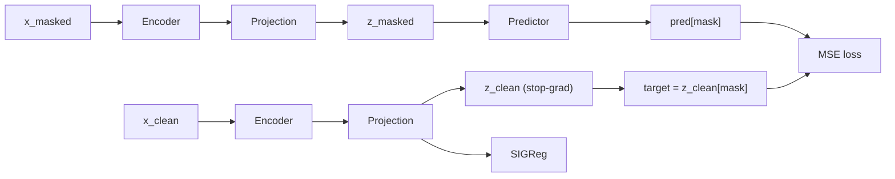
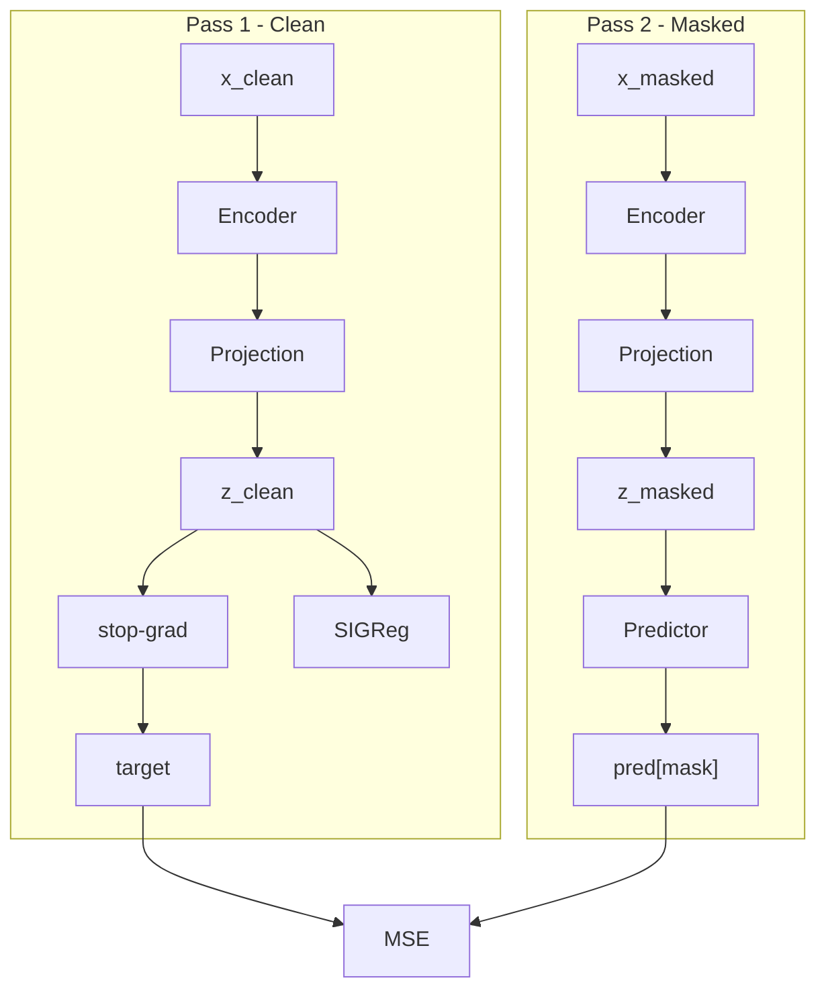

# Masked Latent Prediction — Implementation Plan

## What We Are Building

A BERT-like masked prediction model where:
- Targets are **embeddings in projected space**, not discrete tokens
- Collapse is prevented by **SIGReg**, not EMA
- Encoder is free to be **anisotropic** (semantic geometry)
- SIGReg lives in **projection space** (isotropy enforced there, not in encoder)

---

## Architecture

### Training



> Note: enc1 and enc2 are the **same encoder** — two forward passes, shared weights.

### Module Roles

| Module | Input | Output | Notes |
|--------|-------|--------|-------|
| Encoder | `(B, L)` tokens | `(B, L, D)` | Bidirectional transformer |
| Projection | `(B, L, D)` | `(B, L, P)` | MLP, maps to isotropic space |
| Predictor | `(B, L, P)` | `(B, L, P)` | Lightweight transformer |

### Loss

```
loss = MSE(pred[mask], z_clean[mask].detach())
     + λ · SIGReg(z_clean.reshape(B*L, P))
```

---

## Two Forward Passes



---

## New Implementation at `mask/`

Clean slate — do not modify the existing root-level files. All new code lives in `mask/`.

```
mask/
├── config.py       # dataclass Config
├── model.py        # TokenEncoder, ProjectionMLP, SpanPredictor, LeJEPAText
├── sigreg.py       # SIGReg loss (copy + clean up from root)
├── data.py         # dataset + make_masked_input
├── train.py        # training loop
└── smoke_test.py   # shape checks, end-to-end sanity
```

---

### `mask/config.py`

```python
from dataclasses import dataclass

@dataclass
class Config:
    # Model
    vocab_size:  int   = 50257
    mask_token_id: int = 50256
    d_model:     int   = 256
    d_proj:      int   = 128    # projection space, can differ from d_model
    n_heads:     int   = 8
    enc_layers:  int   = 4
    pred_layers: int   = 2
    seq_len:     int   = 128

    # Masking
    mask_ratio:  float = 0.15
    mask_strategy: str = "random"   # "random" | "span"

    # SIGReg
    lam:               float = 0.05
    sigreg_num_slices: int   = 512
    sigreg_num_points: int   = 17

    # Training
    batch_size:    int   = 32
    lr:            float = 3e-4
    weight_decay:  float = 0.1
    grad_clip:     float = 1.0
    max_steps:     int   = 10_000
    warmup_steps:  int   = 500

    # Data
    shakespeare:   bool  = True
    fake_data:     bool  = False

    # Logging
    log_every:     int   = 50
    rank_every:    int   = 200
```

---

### `mask/model.py`

```python
import torch
import torch.nn as nn


class TokenEncoder(nn.Module):
    """Bidirectional transformer: (B, L) → (B, L, D)"""
    def __init__(self, cfg):
        super().__init__()
        self.tok_emb = nn.Embedding(cfg.vocab_size, cfg.d_model)
        self.pos_emb = nn.Embedding(cfg.seq_len, cfg.d_model)
        self.drop    = nn.Dropout(0.1)
        encoder_layer = nn.TransformerEncoderLayer(
            d_model=cfg.d_model, nhead=cfg.n_heads,
            dim_feedforward=cfg.d_model * 4, batch_first=True,
        )
        self.transformer = nn.TransformerEncoder(encoder_layer, num_layers=cfg.enc_layers)
        self.norm = nn.LayerNorm(cfg.d_model)

    def forward(self, x):                          # x: (B, L)
        B, L = x.shape
        pos  = torch.arange(L, device=x.device).unsqueeze(0)
        h    = self.drop(self.tok_emb(x) + self.pos_emb(pos))
        return self.norm(self.transformer(h))       # (B, L, D)


class ProjectionMLP(nn.Module):
    """(B, L, D) → (B, L, P)  — maps anisotropic encoder space to isotropic space"""
    def __init__(self, d_model, d_proj):
        super().__init__()
        self.net = nn.Sequential(
            nn.Linear(d_model, d_model * 2),
            nn.GELU(),
            nn.Linear(d_model * 2, d_proj),
        )

    def forward(self, x):
        return self.net(x)


class SpanPredictor(nn.Module):
    """Lightweight bidirectional transformer: (B, L, P) → (B, L, P)"""
    def __init__(self, cfg):
        super().__init__()
        layer = nn.TransformerEncoderLayer(
            d_model=cfg.d_proj, nhead=max(1, cfg.n_heads // 2),
            dim_feedforward=cfg.d_proj * 4, batch_first=True,
        )
        self.transformer = nn.TransformerEncoder(layer, num_layers=cfg.pred_layers)
        self.norm = nn.LayerNorm(cfg.d_proj)

    def forward(self, x):                          # (B, L, P) → (B, L, P)
        return self.norm(self.transformer(x))


class LeJEPAText(nn.Module):
    def __init__(self, cfg):
        super().__init__()
        self.encoder   = TokenEncoder(cfg)
        self.proj      = ProjectionMLP(cfg.d_model, cfg.d_proj)
        self.predictor = SpanPredictor(cfg)

    def forward(self, x_clean, x_masked, mask):
        # Pass 1: clean path
        z_clean = self.proj(self.encoder(x_clean))      # (B, L, P) — full grad for SIGReg
        target  = z_clean[mask].detach()                # (M, P)    — stop-grad for MSE

        # Pass 2: masked path
        z_masked = self.proj(self.encoder(x_masked))    # (B, L, P)
        pred     = self.predictor(z_masked)[mask]       # (M, P)

        return pred, target, z_clean
```

---

### `mask/train.py`

```python
import torch
import torch.nn.functional as F
from config import Config
from model import LeJEPAText
from sigreg import sigreg_loss
from data import get_dataloader, make_masked_input


def train(cfg: Config):
    device = "cuda" if torch.cuda.is_available() else "cpu"
    model  = LeJEPAText(cfg).to(device)
    opt    = torch.optim.AdamW(model.parameters(), lr=cfg.lr,
                               weight_decay=cfg.weight_decay)
    loader = get_dataloader(cfg)

    step = 0
    for x_clean in loader:
        if step >= cfg.max_steps:
            break

        x_clean          = x_clean.to(device)
        x_masked, mask   = make_masked_input(x_clean, cfg)

        pred, target, z_clean = model(x_clean, x_masked, mask)

        B, L, P = z_clean.shape
        mse     = F.mse_loss(pred, target)
        reg     = sigreg_loss(z_clean.reshape(B * L, P),
                              cfg.sigreg_num_slices, cfg.sigreg_num_points)
        loss    = mse + cfg.lam * reg

        opt.zero_grad()
        loss.backward()
        torch.nn.utils.clip_grad_norm_(model.parameters(), cfg.grad_clip)
        opt.step()

        if step % cfg.log_every == 0:
            print(f"step {step:05d} | loss {loss:.4f} | mse {mse:.4f} | reg {reg:.4f}")

        step += 1


if __name__ == "__main__":
    train(Config())
```

---

## Build Order

1. `mask/config.py`
2. `mask/sigreg.py` — copy from root, keep as-is
3. `mask/data.py` — copy from root, keep `make_masked_input`
4. `mask/model.py` — write fresh
5. `mask/train.py` — write fresh
6. `mask/smoke_test.py` — shape checks on forward pass
7. Run `python mask/train.py` on Shakespeare, watch loss + rank

---

## What to Check After Training

| Metric | What it tells you | Where |
|--------|-------------------|-------|
| MSE loss ↓ | predictor learning | `train.py` logs |
| SIGReg loss ↓ | embeddings approaching isotropic | `train.py` logs |
| Embedding rank | collapse check (want > 50 for d=256) | `diagnostics.py` |
| Mean cosine sim | collapse check (want < 0.3) | `diagnostics.py` |
| Nearest neighbor coherence | qualitative sanity | `eval_neighbors.py` |

---

## What This Is Not

- Not a generative model — cannot produce tokens
- Not diffusion — single forward pass at inference
- Inference = `encoder(x) → proj(x) → mean pool → embedding` for downstream tasks

---

## Next Step After This Works

Fine-tune contrastively (SimCSE-style) on NLI data, evaluate on MTEB.
Compare against BERT-base init at matched compute.
